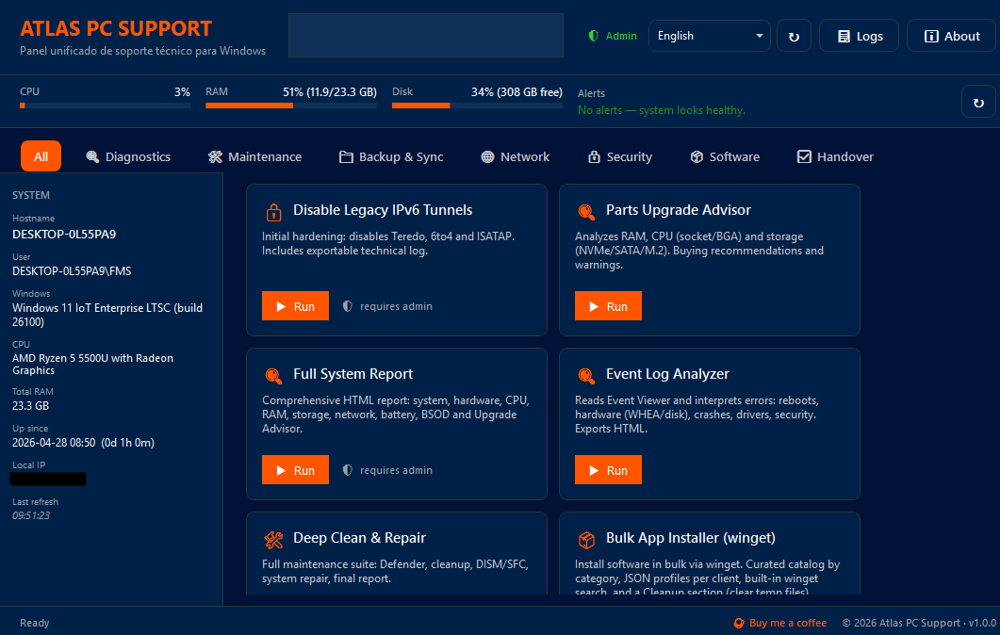

# Atlas PC Support

> Unified Windows technical-support panel for IT professionals — WinUtil-style.

**🌐 Language: English | [Español](README.es.md)**


[](https://www.paypal.me/atlaspcsupport)

Atlas PC Support is a WPF launcher (Fluent / Windows 11 theme) that bundles diagnostics, maintenance, networking, security and handover tools for technicians supporting Windows machines. Inspired by [Chris Titus' WinUtil](https://github.com/ChrisTitusTech/winutil).

---

## 🚀 Quick install (one line)

Open **PowerShell as Administrator** and paste:

```powershell
irm https://raw.githubusercontent.com/mikepchelper-spec/atlas-pc-support/main/launcher.ps1 | iex
```

That's it — nothing else to install. The launcher is downloaded, executed in memory and the panel opens.

> 💡 **Auto-updates**: every time you run that command, the latest build is pulled from GitHub. There is no separate "update" step.

If your PowerShell session ever shows a `#: The term '#' …` error at the start (a stray UTF-8 BOM injected by some local proxy or AV), use this BOM-tolerant variant instead:

```powershell
iex ((irm "https://raw.githubusercontent.com/mikepchelper-spec/atlas-pc-support/main/launcher.ps1?v=$(Get-Random)") -replace '^\uFEFF','')
```

---

## 🖼 Screenshot



A live dashboard banner (CPU / RAM / Disk + alerts) sits above the tool grid, and a system sidebar (hostname, user, Windows build, CPU model, total RAM, uptime, local IP) is visible at all times.

---

## 📦 Bundled tools (v1.0)

The panel ships with **19 tools** grouped in 7 categories. Every tool runs in its own PowerShell window so the UX stays the same as running it standalone.

### 🔍 Diagnostics

| Tool | Description |
|---|---|
| **Parts Upgrade Advisor** | Analyzes RAM, CPU (socket / BGA) and storage (NVMe / SATA / M.2). Buying recommendations and warnings. |
| **Full System Report** | Comprehensive HTML report: system, hardware, CPU, RAM, storage, network, battery, BSOD and Upgrade Advisor. |
| **Event Log Analyzer** | Reads Event Viewer and interprets errors: reboots, hardware (WHEA / disk), crashes, drivers, security. Exports HTML. |

### 🛠 Maintenance

| Tool | Description |
|---|---|
| **Deep Clean & Repair** | Full maintenance suite: Defender, cleanup, DISM / SFC, system repair, final report. |
| **Install/Update PowerShell 7** | Installs or updates PowerShell 7 (modern runtime). Better encoding, modern enums and fewer bugs than Windows PowerShell 5.1. |
| **Windows Tweaks** | Wallpaper via Win32 API, dark theme, accent color, taskbar tweaks and watermark. |
| **Service Optimizer** | Stops and sets to Manual non-essential services: telemetry, Xbox, sensors, fax, etc. |

### 📁 Backup & Sync

| Tool | Description |
|---|---|
| **FastCopy** | Multi-source copy with profiles, comparison, MD5 and exportable summary. Better UX than Robocopy. |
| **Build Offline USB** | Copies the panel and its dependencies to a USB drive for offline use. Auto-updates the launcher when connected to the internet. |
| **Robocopy Mirror** | Optimized robocopy-based copy: mirror mode, retries, centralized logging. |

### 🌐 Network

| Tool | Description |
|---|---|
| **DNS Switcher** | Switches DNS server between profiles (Cloudflare, Google, OpenDNS, custom) with one click. Includes latency test and DoH toggle. |
| **Hosts File Editor** | Windows HOSTS file editor with automatic backup, Steven Black list import and revert. |
| **Router Security Audit** | Local network router scan and security audit (gateway port scan, ARP, Wi-Fi passwords). |

### 🔒 Security

| Tool | Description |
|---|---|
| **Disable Legacy IPv6 Tunnels** | Initial hardening: disables Teredo, 6to4 and ISATAP. Includes exportable technical log. |
| **BitLocker Manager** | BitLocker status, activation, suspension and recovery key export. |
| **Local Account Hardening** | Audits and applies principle-of-least-privilege to local user accounts. |
| **Extract Product Keys** | Extracts Windows and Office product keys (read-only, safe). |

### 📦 Software

| Tool | Description |
|---|---|
| **Bulk App Installer (winget)** | Install software in bulk via winget. Curated catalog by category, JSON profiles per client, built-in winget search, and a Cleanup section (clear temp files). |

### ✅ Handover

| Tool | Description |
|---|---|
| **PC Handover Report** | Closeout protocol: rename PC, run final cleanup, generate branded HTML report (system summary + handover checklist + print-to-PDF). |

---

## 🌍 Languages

The panel detects your system language automatically and ships with full translations for:

**English (default), Spanish, Portuguese, French, German, Italian, Romanian.**

You can switch language at runtime via the dropdown in the panel header. To force a specific language, set it in `branding.json`:

```json
{ "language": "en" }
```

Valid values: `"auto"`, `"en"`, `"es"`, `"pt"`, `"fr"`, `"de"`, `"it"`, `"ro"`. See [docs/LANGUAGES.md](docs/LANGUAGES.md) for adding more.

---

## 🎨 Custom branding

The panel accepts a **`branding.json`** file with your own brand: name, logo, colors, tagline, copyright, etc. Useful if you resell the panel or configure it for a specific client.

Copy `branding.example.json` to `branding.json` and edit it:

```json
{
  "brand": {
    "name": "YOUR SUPPORT COMPANY",
    "tagline": "Technical support for SMBs",
    "companyUrl": "https://mycompany.com",
    "copyright": "© 2026 My Company"
  },
  "theme": {
    "accentColor": "#0078D4",
    "darkMode": false,
    "cornerRadius": 4
  },
  "window": {
    "title": "My Company Panel v1.0"
  }
}
```

The launcher looks for `branding.json` in this order:

1. `branding.json` next to `launcher.ps1` (local repo).
2. `%LOCALAPPDATA%\AtlasPC\branding.json` (per-user profile).
3. `%APPDATA%\AtlasPC\branding.json`.

If none exist, the default Atlas branding is used.

📘 Full details in [docs/BRANDING.md](docs/BRANDING.md).

### Custom short domain

If you own a domain, you can serve the launcher from `tools.yourdomain.com` using Cloudflare Workers (free, ~10 minutes of setup). Step-by-step instructions in [docs/CLOUDFLARE-DOMAIN.md](docs/CLOUDFLARE-DOMAIN.md).

---

## 🧑‍💻 Local development

```powershell
git clone https://github.com/mikepchelper-spec/atlas-pc-support
cd atlas-pc-support

# Run in dev mode (uses src/, no compile step):
pwsh -NoProfile -ExecutionPolicy Bypass -File src\Launcher.ps1

# Or build the distributable launcher:
pwsh -NoProfile -File build.ps1
# This regenerates launcher.ps1 (repo root) with everything embedded.
```

### Repo layout

```
atlas-pc-support/
├── launcher.ps1              ← Compiled. This is what `irm | iex` downloads.
├── build.ps1                 ← Regenerates launcher.ps1 from src/.
├── branding.example.json     ← Custom-branding template.
├── README.md / README.es.md  ← English / Spanish docs.
├── LICENSE / .gitignore
├── config/
│   └── tools.json            ← Tool manifest (see "Add a tool" below).
├── docs/                     ← Guides + screenshots.
├── onboarding/               ← Standalone RustDesk client onboarding installer.
├── src/
│   ├── Launcher.ps1          ← Dev entry point.
│   ├── lib/                  ← Helpers (Branding, Admin, Logging, Dependencies, ToolRunner, PS7).
│   ├── gui/                  ← XAML + WPF GUI controllers.
│   └── tools/                ← One tool per file (`Invoke-XXX.ps1`).
└── .github/workflows/        ← CI rebuilds launcher.ps1 on every push.
```

### Add a new tool

1. Create `src/tools/Invoke-MyTool.ps1`:
   ```powershell
   function Invoke-MyTool {
       [CmdletBinding()] param()
       Write-Host "Hello from MyTool"
       Read-Host "Press ENTER to exit"
   }
   ```
2. Register it in `config/tools.json`:
   ```json
   {
     "id": "my-tool",
     "name": "My Tool",
     "description": "Short description (~150 chars max).",
     "category": "mantenimiento",
     "function": "Invoke-MyTool",
     "source": "MyTool.ps1",
     "requiresAdmin": false,
     "runsInNewWindow": true,
     "dependencies": []
   }
   ```
3. Run `pwsh -File build.ps1`.
4. Commit and push — CI rebuilds `launcher.ps1` automatically.

See [docs/ADDING-TOOLS.md](docs/ADDING-TOOLS.md) for the full reference.

---

## 📋 Logs and dependencies

- **Logs**: `%LOCALAPPDATA%\AtlasPC\logs\atlas-YYYY-MM-DD.log`.
- **External binaries** (FastCopy.exe, etc.): downloaded on demand to `%LOCALAPPDATA%\AtlasPC\bin\`.
- **Client data / reports**: stored in `%USERPROFILE%\Documents\AtlasPC\` and never committed to the repo.

---

## 🛡 Requirements

- Windows 10 / 11 (x64).
- PowerShell 5.1 (built into Windows) or PowerShell 7.
- Run **as Administrator** to use every tool.

---

## 📄 License

[MIT](LICENSE). Use, modify and redistribute freely, including commercially. Just keep the copyright notice.

---

## 🙋 Support

If you are a professional technician and want:

- A **branded version** with your own logo, colors and company-specific tools.
- **Premium email support**.
- A **pre-configured bundle** for fleets of 10+ PCs.

Visit [atlaspcsupport.com](https://atlaspcsupport.com) or open an issue.

---

## 🙏 Acknowledgements

- [Chris Titus Tech · WinUtil](https://github.com/ChrisTitusTech/winutil) — inspiration and architecture.
- [ModernWpfUI](https://github.com/Kinnara/ModernWpf) — Fluent style reference.
- The PowerShell community.
